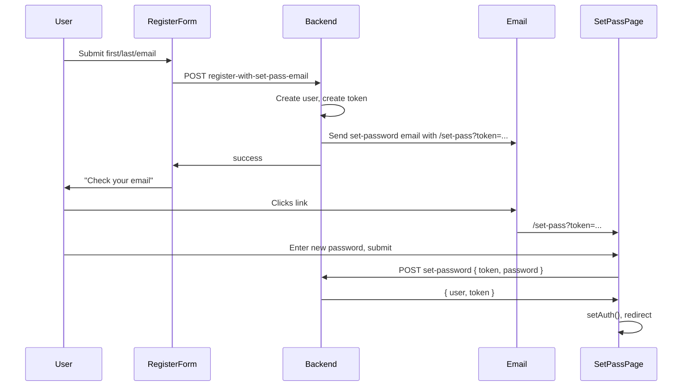

# Register + Set Password Email Flow

## 1. Backend: new REST endpoint

**File:** [brennans-wave-wp/public/api/auth.php](brennans-wave-wp/public/api/auth.php)

- **New route:** `POST brennan/v1/register-with-set-pass-email`
  - **Permission:** `__return_true` (public).
  - **Body:** `firstName`, `lastName`, `email` (all required). Optional: `set_password_base_url` (string) so the email link points to the Next.js app (e.g. `https://brennanswave.com`).
- **Handler** (e.g. `brennan_api_register_with_set_pass_email`):
  1. Validate/sanitize `firstName`, `lastName`, `email`.
  2. If `email_exists($email)`, return `{ success: false, error: 'Email already exists.' }` (400).
  3. Create user with `wp_insert_user`:
    - `user_login` => email
    - `user_pass` => `wp_generate_password()` (random placeholder)
    - `user_email`, `first_name`, `last_name`, `role` => subscriber
  4. Reuse the same token + email logic as `brennan_api_generate_set_password_token`:
    - Generate token with `brennan_create_rand_str(64)`, store in `brennan_set_password_token` and `brennan_set_password_token_expires` (5 days).
    - Build link: base URL = `$body['set_password_base_url']` if set (trimmed), else `home_url('/')`; path = `/set-pass` (to match frontend route). Final URL: `rtrim($base_url, '/') . '/set-pass?token=' . urlencode(base64_encode($token . '|' . $user_id))`.
    - Load `emails/default.html`, replace `{email_subject}`, `{$user_name}`, `{$set_password_url}`, `{$current_year}`, send via `wp_mail`.
  5. On success return `{ success: true, message: '...' }`. Do **not** return a login token (user must set password first).

**Optional:** Extract a shared helper (e.g. `brennan_send_set_password_email( $user_id, $base_url_for_link )`) used by both `brennan_api_generate_set_password_token` and the new handler to avoid duplication. The existing admin endpoint can keep using `home_url()` and path `/set-password` unless you want to unify later.

---

## 2. Frontend: auth API helper

**File:** [brennanswave/src/lib/auth-api.ts](brennanswave/src/lib/auth-api.ts)

- Add:
  - `**registerWithSetPassEmail(firstName: string, lastName: string, email: string, setPasswordBaseUrl?: string)`**
  - POST to `{apiBase}/wp-json/brennan/v1/register-with-set-pass-email` with body `{ firstName, lastName, email, set_password_base_url?: setPasswordBaseUrl }`.
  - Return type: `{ success: true; message: string } | { success: false; error: string }`.
  - Use same `getApiBase()` as existing; for `setPasswordBaseUrl` the caller can pass `typeof window !== 'undefined' ? window.location.origin : ''` so the email link matches the current app origin.

---

## 3. Frontend: RegisterForm component

**File:** [brennanswave/src/components/auth/RegisterForm.tsx](brennanswave/src/components/auth/RegisterForm.tsx) (new)

- **UI (shadcn):** `Label`, `Input`, `Button` from existing UI components.
- **Fields:**
  - First Name (text)
  - Last Name (text)
  - Email Address (type="email")
  - Below the fields, small text: “Password set link will be emailed to you.”
  - Submit button: blue background, white text (e.g. `className="bg-blue-600 text-white hover:bg-blue-700"` or use a primary variant if your theme already has blue).
- **Behavior:**
  - Controlled state for firstName, lastName, email; loading and error state.
  - On submit: call `registerWithSetPassEmail(firstName, lastName, email, window.location.origin)`.
  - On success: show a success message (e.g. “Check your email for the password setup link.”) and optionally clear form or disable submit.
  - On error: show API `error` message.
- **Props:** Can accept optional `onSuccess?: () => void` and/or `successMessage?: ReactNode` for reuse in a dialog vs page.

**File:** [brennanswave/src/components/auth/Register.tsx](brennanswave/src/components/auth/Register.tsx)

- Export the form or a thin wrapper (e.g. render `RegisterForm` inside a card or dialog) so the app can use either a full-page register or a dialog. Minimal change: have `Register.tsx` export `RegisterForm` from `RegisterForm.tsx` for convenience, or render the form in a simple card layout here.

---

## 4. Frontend: Set Password page

**File:** [brennanswave/src/app/set-pass/page.tsx](brennanswave/src/app/set-pass/page.tsx)

- **Route:** `/set-pass?token=...` (token from email link).
- **Layout:** Use existing `Header` and `Footer`; center content in main.
- **Logic (client component):**
  1. Read `token` from URL: `useSearchParams().get('token')`.
  2. If no token: show message “Invalid or expired link” (and optional link back to login/register).
  3. If token present: show a “Set password” form:
    - New password (type="password")
    - Confirm password (optional but recommended)
    - Submit button
  4. On submit: POST to existing `brennan/v1/set-password` with body `{ token: tokenFromUrl, password }`. Use the **raw** `token` query param (the backend expects the same base64 string that was in the link).
  5. On success: backend returns `{ success, user, token }`; call `setAuth(result.token, result.user)` and redirect (e.g. `router.push('/report')`) or show “Password set” and a link to go home.
  6. On error: show API error (e.g. “Invalid or expired token”).
- **Auth API:** Add in [auth-api.ts](brennanswave/src/lib/auth-api.ts):
  - `**setPasswordWithToken(token: string, password: string)`** – POST to `brennan/v1/set-password` with `{ token, password }`, return typed success/error (success includes `user` and `token` for immediate login).

---

## 5. Data flow summary

---

## 6. Files to add or touch

| Location                                                              | Action                                                                                                                                                                         |
| --------------------------------------------------------------------- | ------------------------------------------------------------------------------------------------------------------------------------------------------------------------------ |
| [auth.php](brennans-wave-wp/public/api/auth.php)                      | Register route `register-with-set-pass-email`; add handler (create user with random pass, then send set-password email with `/set-pass` path and optional base URL from body). |
| [auth-api.ts](brennanswave/src/lib/auth-api.ts)                       | Add `registerWithSetPassEmail()`, add `setPasswordWithToken()`.                                                                                                                |
| [RegisterForm.tsx](brennanswave/src/components/auth/RegisterForm.tsx) | New: form with first name, last name, email, small text, blue submit; call register API.                                                                                       |
| [Register.tsx](brennanswave/src/components/auth/Register.tsx)         | Export or render RegisterForm (e.g. in a card).                                                                                                                                |
| [set-pass/page.tsx](brennanswave/src/app/set-pass/page.tsx)           | New: read `token` from query; form for new (+ confirm) password; call setPasswordWithToken; on success setAuth and redirect.                                                   |

---

## 7. Set-password link URL

- Backend will use path `**/set-pass**` in the email link so it matches the Next app route.
- If the Next app is on a different origin than WordPress, the frontend should send `set_password_base_url` (e.g. `window.location.origin`) in the register request so the link points to the correct domain. If same origin, you can omit it and rely on `home_url()`.
